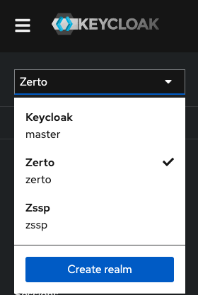

# Zerto ZVM Health Checker

This is a companion script designed to run along side the Linux ZVM.

## How It Works

This is a Python script ran as a systemd service that checks the status of your ZVM every 10 minutes. If there is a problem for three consecutive checks (30 minutes), a problem is reported and emailed. If there is a problem that persists through the three consecutive checks, the chances of it being a false positive are next to none.

We suggest keeping this at the default of 10 minutes to avoid bogging down the ZVM with API calls.

The three problems this script looks for:

* If total ZVM throughput in MBs drops to zero
* If the throughput of a single site drops to zero
* A certain percentage of VPGs (default 90%) are considered down

## Keycloak

We will need to create a Client inside of Keycloak that we will use to authenticate against the ZVM API.

1. Log in to Keycloak at h<span>ttps:</span>//ZVM-IP/auth as your admin user that came preconfigured with the ZVM and go to the "zerto" Realm in the top left



2. Go to "Client" and create a new client
    - Client ID: zerto-api
        - Next
    - Turn on "Client authentication" and "Authroization", check the "Standard flow", "Implicit flow", and "Direct access grants" boxes
    - Save (No other changes need to be made)

3. Go to the newly made zerto-api client, go to the "Credentials" tab and copy the "Client Secret" for later use.

## Installation


Begin by making a directory called 'Zerto-Alerts' and entering it.

```
cd && mkdir Zerto-Alerts && cd Zerto-Alerts
```

Then run the following to download the files and make the installation and run scripts executable.

```
curl -LO https://github.com/DOGE28/Zerto-VPG-Checker-Linux/archive/refs/heads/Client.zip
unzip Client.zip
rm Client.zip
cd Zerto-VPG-Checker-Linux-Client
chmod +x install.sh
chmod +x run.sh
```

> [!Note]
> You may need to download unzip if the above script does not work. ```sudo apt install unzip```


Please have the following before continuing:

* Keycloak zerto-api client secret
* SMTP server IP/FQDN
* SMTP port 
* Email address to send alerts
* Email address(s) to receive alerts
* VPG threshold percent (default: 90)
    - If percent of VPGs **UP** is less than this, report a problem
* Run interval in minutes (default: 10)

Next, run the following to begin the installation

```
./install.sh
```

This will install all needed dependencies, create a `.env` file with the prompted information, and create a system service that will run on startup.
If you ever need to change the information you initially provided in the installtion script, you can change them in the created `.env` file. 


## Systemd Commands

The install script will get everything ready for the monitor to run continuously, even after restart. Below are some relevant commands you may want to know.

Starts the `zerto-alerts` service:

```
sudo systemctl start zerto-alerts
```

Restarts the service

```
sudo systemctl restart zerto-alerts
```

This command will check the status of the service and include important information from the most recent run of the monitor. If there are issues with your deployment, this will inform you of what isn't working.

```
sudo systemctl status zerto-alerts
```
